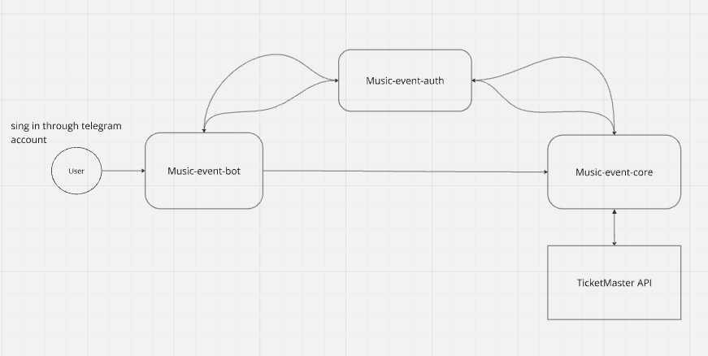

# Music-event-bot

## To run app locally: 
- run all services:
  - music-event-auth
  - music-event-core
  - music-event-bot (current)
- run ngrok (see music-event-auth README.md)
- change value in [application.yaml](src/main/resources/application.yaml) 
__*application.music-event-auth-https*__ to new ngrok address
- set new bot domain in BotFather

This application use **telegram** authentication for user authentication. 
And **client-credentials** flow for server interactions.

You can take a look at the diagrams below:

How the application works

Client-credentials flow

### Telegram Java classes

#### InlineKeyboardMarkup:
- When you want buttons to appear within a specific message.
- When you need to handle button clicks without sending a visible message to the chat.
- For interactive features like voting, pagination, or navigation.

#### ReplyKeyboardMarkup
- When you want a persistent keyboard for quick replies.
- When you want to simplify user input by providing predefined options.
- For scenarios where the user needs to repeatedly select from a set of options.

